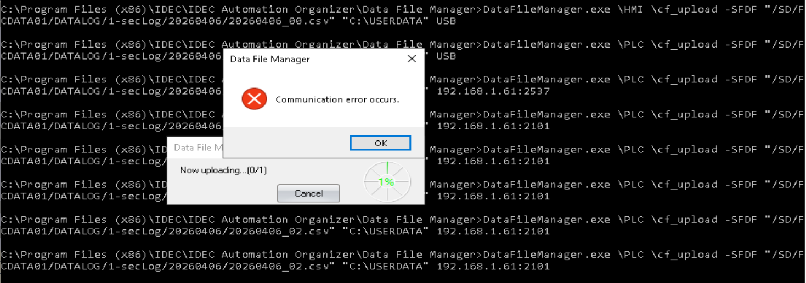
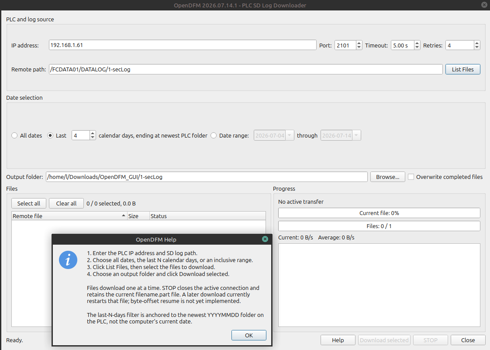

# OpenDFM
<pre>
OpenDFM is a utility for pulling remote logs for date formated datalogs from IDEC PLCs. 
I cant do anything about the transfer speed, but we can improve reliability.

<b>Motive:</b>
  I was confused and frustrated by the functionality of other methods.
 Downloading for an hour, network interupts, no data retrieved. :(
  
  
<b>We're done with that!</b>
  
  
<b>CLI Functionality:</b>
List and download all the logs:
$ ./OpenDFM.py 
pull_sd_logs_native 2026.07.14.2; MiSmSDCard 2026.07.14.2
Listing /FCDATA01/DATALOG/1-secLog
Listing /FCDATA01/DATALOG/1-secLog/20260328
...

<b> list a specifed range of dates, and files </b>
$ ./OpenDFM.py  --start-date 20260428  --end-date 20260503  --list-only
pull_sd_logs_native 2026.07.14.2; MiSmSDCard 2026.07.14.2
Listing /FCDATA01/DATALOG/1-secLog
Listing /FCDATA01/DATALOG/1-secLog/20260501
Listing /FCDATA01/DATALOG/1-secLog/20260502
Listing /FCDATA01/DATALOG/1-secLog/20260503

Date range: 20260428 through 20260503, inclusive
Found 3 folders and 7 files, 25.8 MiB total.
/FCDATA01/DATALOG/1-secLog/20260501/20260501_00.csv  453802 bytes
/FCDATA01/DATALOG/1-secLog/20260502/20260502_00.csv  5242894 bytes
/FCDATA01/DATALOG/1-secLog/20260502/20260502_01.csv  5242894 bytes
/FCDATA01/DATALOG/1-secLog/20260502/20260502_02.csv  2821860 bytes
/FCDATA01/DATALOG/1-secLog/20260503/20260503_00.csv  5242894 bytes
/FCDATA01/DATALOG/1-secLog/20260503/20260503_01.csv  5242916 bytes
/FCDATA01/DATALOG/1-secLog/20260503/20260503_02.csv  2838643 bytes

<b>GUI: A user friendly interface </b>

More Detail in the OpenDFM_CLI and OpenDFM_GUI folders

<b> </b>
<b> </b>
<b> </b>

</pre>
