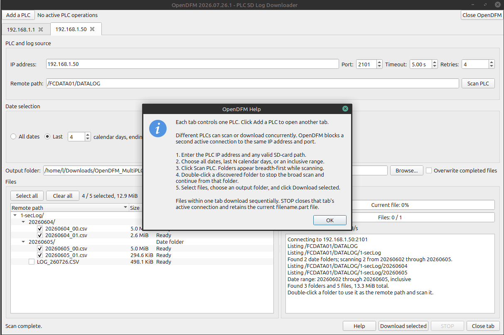

# OpenDFM

OpenDFM downloads files from SD cards installed in IDEC PLCs over the
Ethernet Maintenance Protocol.

The PLC controls the available transfer speed, but OpenDFM can make the process
more reliable, observable, and recoverable.



## Applications

OpenDFM includes two user-facing applications:

| Application | Purpose |
| --- | --- |
| [OpenDFM GUI](OpenDFM_GUI/README.md) | Interactive SD-card browsing, date filtering, file selection, progress reporting, and concurrent work with multiple PLCs |
| [OpenDFM CLI](OpenDFM_CLI/README.txt) | Scriptable listing and downloading for one PLC at a time |

The GUI and CLI are separate builds and do not currently have identical browsing
behavior. The GUI contains the newer shared backend and supports date folders at
any depth below the selected remote path.

## What OpenDFM does

- Connects to IDEC PLCs over TCP, using port `2101` by default.
- Lists files and folders on the PLC SD card.
- Preserves the remote directory structure in the local output folder.
- Selects all logs, the last N calendar days, or an inclusive date range.
- Retries transient directory and file-transfer failures.
- Verifies downloaded file sizes.
- Retains incomplete downloads as `.part` files.
- Skips complete local files unless overwrite is enabled.
- Provides both graphical and command-line workflows.

The OpenDFM applications list and download files. They do not upload files to the
PLC or modify the PLC program.

## Requirements

### PLC

- An IDEC PLC reachable from the computer running OpenDFM.
- An Ethernet connection configured for Maintenance Communication.
- The correct TCP port; OpenDFM defaults to `2101`.
- An inserted and recognized SD card.
- A valid remote SD-card directory.

The default paths are examples and may not match every PLC project:

```text
/FCDATA01/DATALOG
/FCDATA01/DATALOG/1-secLog
```

### Computer

- Python 3.
- PyQt5 for the GUI.
- Network access to the PLC.

On Linux Mint or Ubuntu:

```bash
sudo apt install python3-pyqt5
```

The command-line application uses Python's standard library and the included
OpenDFM modules.

## Quick start

Clone the repository:

```bash
git clone https://github.com/FOSSBOSS/OpenDFM.git
cd OpenDFM
```

### Run the GUI

```bash
cd OpenDFM_GUI
python3 OpenDFM.py
```

The GUI supports multiple PLC tabs, folder browsing, date filters, selected-file
downloads, transfer progress, retries, and immediate STOP behavior.

See the [GUI documentation](OpenDFM_GUI/README.md) for the complete workflow.

### Run the CLI

```bash
cd OpenDFM_CLI
python3 OpenDFM.py --host 192.168.1.61 --days 5
```

Preview the selected files without downloading:

```bash
python3 OpenDFM.py \
    --host 192.168.1.61 \
    --remote /FCDATA01/DATALOG/1-secLog \
    --days 5 \
    --list-only
```

Download an inclusive date range:

```bash
python3 OpenDFM.py \
    --host 192.168.1.61 \
    --start-date 20260630 \
    --end-date 20260704
```

Run the following command for every available CLI option:

```bash
python3 OpenDFM.py --help
```

## Reliability behavior

### Retries

OpenDFM retries transient directory-listing and file-transfer failures. The retry
count and timeout are configurable.

### Partial files

Data is written to `filename.part` during a transfer. The final filename is
created only after the complete file has been received.

If a transfer is stopped or fails, the `.part` file is retained for inspection.
The current protocol implementation cannot resume from a byte offset, so the
individual file restarts from the beginning on the next attempt.

### Existing files

A local file with the expected size is skipped unless overwrite is enabled. This
allows repeated collection runs without downloading every completed file again.

### Multiple PLCs

The GUI can scan or download from different PLCs concurrently. Files within one
PLC tab are downloaded sequentially.

OpenDFM prevents two active tabs from using the same IP address and port at the
same time.

## Repository layout

```text
OpenDFM/
├── OpenDFM_GUI/       Multi-PLC PyQt5 application and current shared backend
├── OpenDFM_CLI/       Standalone command-line application
├── imgs/              Screenshots used by the documentation
└── README.md          Project overview
```

Important GUI files:

| File | Purpose |
| --- | --- |
| `OpenDFM.py` | Main window, PLC tabs, workers, progress, settings, and error handling |
| `OpenDFM.ui` | Qt Designer main-window layout |
| `OpenDFMTab.ui` | Qt Designer layout used by each PLC tab |
| `open_dfm_backend.py` | Directory discovery, date filtering, and reliable downloads |
| `MiSmSDCard.py` | SD-card Maintenance Protocol operations |
| `MiSmTCP.py` | TCP Maintenance Protocol transport |
| `pull_sd_logs_native.py` | Command-line downloader using the GUI's shared backend |
| `CHANGELOG.txt` | GUI release history |

## Current limitations

- Transfer speed is limited by the PLC and its SD-card protocol.
- Interrupted files cannot currently resume from the previous byte offset.
- Files within one GUI tab transfer one at a time.
- The GUI currently uses Ethernet through `MiSmTCP`.
- Date filtering recognizes folders named `YYYYMMDD`.
- PLC projects may use different SD-card directory structures; verify the remote
  path before starting a large download.

## Project status

OpenDFM is actively being tested against real IDEC PLCs and SD-card logging
projects. Review [OpenDFM_GUI/CHANGELOG.txt](OpenDFM_GUI/CHANGELOG.txt) for the
latest changes and test behavior.
